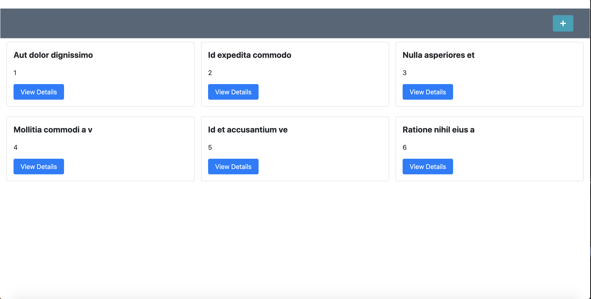
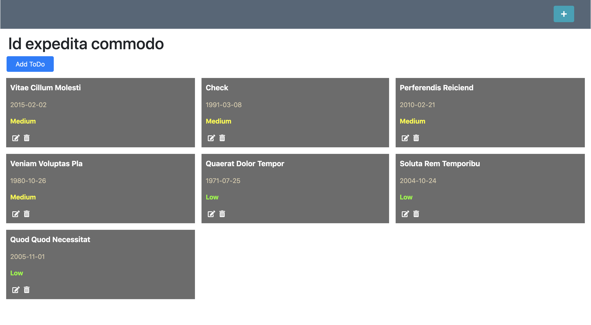
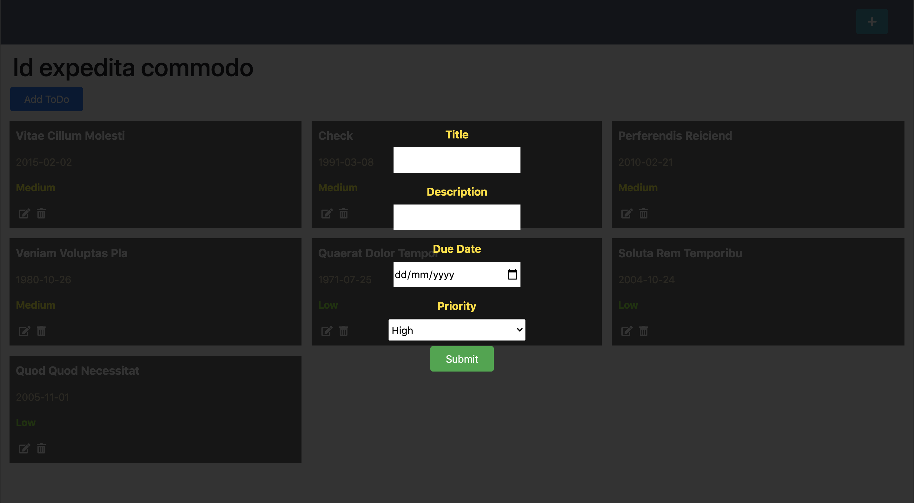

# JS-To-Do-List
Learning the concepts of Single Responsibility and Tightly Coupled Objects in Javascript

## Built With

- HTML,
- CSS,
- JavaScript,
- Bootstrap
- Webpack

## Live demo Link

[live link](https://rawcdn.githack.com/OdongAlican/JS-To-Do-List/3a86b65dc66bbd7be54e098d4dd2f6db1ce57300/dist/index.html)

### Prerequisites

- Any kind of browser supporting CSS3 and HTML5

### Setup

- Fork the repo to your remote repository.
- Clone or download the repository to your local machine.

### Install

- Ensure that you have node.js and npm installed in your machine.
- Run `npm install`to install the project packages

### Usage section.

- Run `npm run dev`to bundle the packages for development. Dev is created for development, meaning that it supports hot module replacement, dev server, and a lot of things that assist your dev work
- Run `npm run build` when you want to deploy the project for production.
## Authors

👤 **Rahma Halane**

- [Portfolio](https://raw.githack.com/imahnama/my-portfolio/develop/index.html)
- [Twitter](https://twitter.com/halane_rahma)
- [Linkedin](https://www.linkedin.com/in/rahmahalane/)
- [Email](mailto:Halane.rahma@gmail.com )

👤 **Odong Sunday**

- [Portfolio](https://odongsunday.netlify.app/)
- Github: [@OdongAlican](https://github.com/OdongAlican)
- Twitter: [@odongsandie](https://twitter.com/odongsandie)
- Linkedin: [Sunday Alican odong](https://www.linkedin.com/in/sunday-alican-odong/)
- [Email](mailto:sandieo.2020@gmail.com)

## 🤝 Contributing

Contributions, issues and feature requests are welcome!

Feel free to check the [issues page](https://github.com/OdongAlican/JS-To-Do-List/issues).

## Show your support

Give a ⭐️ if you like this project!
